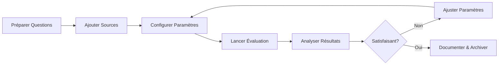

# GUIDE D'UTILISATION - FICHIER D'ÉVALUATION RAG

## 📋 OBJECTIF
Ce fichier Excel permet de mener des tests d'évaluation de systèmes RAG (Retrieval-Augmented Generation) avec différents paramétrages et configurations.

---

## 📁 STRUCTURE DU FICHIER

### Onglet 1 : INSTRUCTIONS
Guide d'utilisation du fichier (cet onglet)

### Onglet 2 : JEU_OR
Questions de test et réponses de référence (gold standard)
- **id** : Identifiant unique de la question
- **question** : Question à poser au système RAG
- **reponse_reference** : Réponse attendue (ground truth)
- **contexte_attendu** : Documents sources attendus (optionnel)
- **categorie** : Catégorie de la question (optionnel)
- **difficulte** : Niveau de difficulté (optionnel)

### Onglet 3 : SOURCES
Documents sources utilisés pour la génération
- **doc_id** : Identifiant du document
- **source_name** : Nom du fichier source
- **content** : Contenu textuel du document
- **metadata** : Métadonnées JSON (optionnel)

### Onglet 4 : SORTIE_EVALUATIONS
Résultats des évaluations avec métriques
- Reprend les colonnes de JEU_OR
- **reponse_modele** : Réponse générée par le système
- **contexte_recupere** : Contextes utilisés pour la génération
- **Métriques d'évaluation** : faithfulness, answer_relevancy, context_precision, context_recall
- **Métriques de performance** : latency, tokens, coût estimé
- **Paramètres** : model_provider, temperature, etc.

---

## 🚀 PROCESSUS D'UTILISATION

### Étape 1 : Préparation des données
1. Remplir l'onglet **JEU_OR** avec vos questions de test
2. Ajouter les documents sources dans l'onglet **SOURCES**
3. Vérifier que les IDs sont uniques et cohérents

### Étape 2 : Configuration des tests
Paramètres à définir dans le fichier .env ou le notebook :
- **MODEL_PROVIDER** : `openai`, `anthropic`, `gemini`, `ollama`
- **TEMPERATURE** : 0.0 à 1.0 (contrôle la créativité)
- **TOP_K** : Nombre de tokens à considérer (ex: 40)
- **TOP_P** : Probabilité cumulative (ex: 0.9)
- **MAX_TOKENS** : Longueur maximale de réponse (ex: 512)
- **BATCH_SIZE** : Taille des lots pour l'évaluation (ex: 16)

### Étape 3 : Exécution de l'évaluation
```bash
# Via Jupyter Notebook
jupyter notebook POC_Eval_Ragas_Langfuse.ipynb

# Ou directement via Python
python evaluate.py --input fichier.xlsx --output resultats.xlsx
```

### Étape 4 : Analyse des résultats
Consulter l'onglet **SORTIE_EVALUATIONS** pour :
- Comparer les réponses générées vs références
- Analyser les scores de qualité
- Identifier les cas d'échec
- Mesurer les performances (latence, coûts)

---

## 📊 MÉTRIQUES D'ÉVALUATION

### Métriques de Qualité (scores de 0 à 1)

| Métrique | Description | Interprétation |
|----------|-------------|----------------|
| **Faithfulness** | Fidélité au contexte | Mesure si la réponse est ancrée dans les documents récupérés |
| **Answer Relevancy** | Pertinence de la réponse | Évalue si la réponse répond bien à la question posée |
| **Context Precision** | Précision du contexte | Qualité des documents récupérés (sont-ils tous pertinents ?) |
| **Context Recall** | Rappel du contexte | Complétude des documents récupérés (a-t-on tout trouvé ?) |
| **Context Entities Recall** | Rappel des entités | Présence des entités importantes dans le contexte |

### Métriques de Performance

| Métrique | Description | Unité |
|----------|-------------|-------|
| **Latency** | Temps de génération | Secondes |
| **Tokens Used** | Tokens consommés | Nombre |
| **Cost Estimate** | Coût estimé | USD |

---

## ⚙️ PARAMÈTRES DE TEST RECOMMANDÉS

### Pour tests de précision
```
TEMPERATURE = 0.0
TOP_P = 0.1
MAX_TOKENS = 256
```

### Pour tests de créativité
```
TEMPERATURE = 0.7
TOP_P = 0.9
MAX_TOKENS = 512
```

### Pour tests de robustesse
```
TEMPERATURE = 0.3
TOP_P = 0.5
MAX_TOKENS = 384
```

---

## ⚠️ POINTS D'ATTENTION

### Bonnes pratiques
- ✅ **IDs uniques** : Chaque question doit avoir un ID unique
- ✅ **Sauvegardes** : Créer une copie avant chaque test
- ✅ **Versioning** : Nommer les fichiers avec date/version
- ✅ **Documentation** : Noter les paramètres utilisés dans les notes

### Erreurs communes à éviter
- ❌ Dupliquer des IDs dans JEU_OR
- ❌ Références circulaires entre questions
- ❌ Caractères spéciaux non échappés dans les questions
- ❌ Documents sources trop longs (> 8000 tokens)

### Limites techniques
- Maximum 1000 questions par batch d'évaluation
- Documents sources limités à 8192 tokens chacun
- Temps d'évaluation : ~2-5 secondes par question

---

## 📝 EXEMPLES DE CAS D'USAGE

### Test A/B de modèles
1. Même dataset, différents MODEL_PROVIDER
2. Comparer les scores de faithfulness et relevancy
3. Analyser les différences de latence et coût

### Optimisation de paramètres
1. Même modèle, varier TEMPERATURE de 0.0 à 1.0
2. Observer l'impact sur la créativité vs précision
3. Trouver le sweet spot pour votre use case

### Validation de mise à jour
1. Tester avant/après ajout de nouveaux documents
2. Vérifier l'amélioration du context_recall
3. S'assurer qu'il n'y a pas de régression

---

## 🆘 SUPPORT ET RESSOURCES

- **Documentation technique** : voir CLAUDE.md dans le projet
- **Notebooks d'exemple** : `POC_Eval_Ragas_Langfuse.ipynb`
- **Configuration** : fichier `.env.template` pour les variables
- **Logs** : vérifier `data/logs/` pour le debugging

---

## 📈 WORKFLOW TYPE D'ÉVALUATION



---

_Version 1.0 - Guide d'utilisation pour tests d'évaluation RAG_