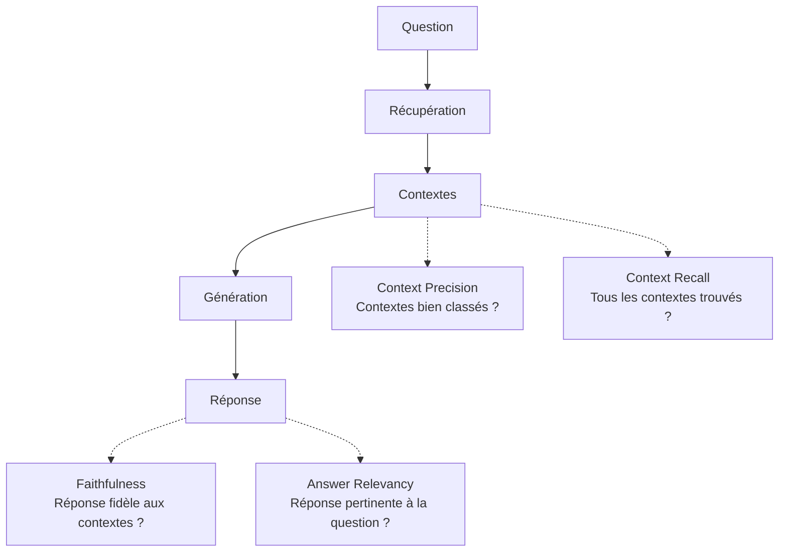

# 📊 DOCUMENTATION COMPLÈTE DES MÉTRIQUES RAGAS

## 🎯 Vue d'ensemble

Ragas (Retrieval Augmented Generation Assessment) fournit un ensemble de métriques pour évaluer la qualité des systèmes RAG. Ces métriques évaluent à la fois la **qualité de récupération** (retrieval) et la **qualité de génération** (generation).

---

## 📈 Les 5 Métriques Essentielles pour l'Évaluation RAG

### 1. 🎯 Faithfulness (Fidélité)

**Définition officielle** : Mesure à quel point la réponse générée est **factuellement cohérente** avec les contextes récupérés.

**Ce qu'elle évalue** : La fidélité vérifie que le système ne "hallucine" pas - toutes les affirmations dans la réponse doivent être supportées par les documents récupérés.

**Données requises** :
- `answer` : La réponse générée par votre système RAG
- `contexts` : Les contextes/documents récupérés

**Formule de calcul** :
```
Faithfulness = Nombre d'affirmations supportées par les contextes
              ÷ Nombre total d'affirmations dans la réponse
```

**Processus détaillé** :
1. La réponse est décomposée en affirmations individuelles
2. Chaque affirmation est vérifiée contre les contextes
3. Score = ratio des affirmations vérifiées

**Interprétation des scores** :
- **1.0** : Parfait - Toutes les affirmations sont supportées par les contextes
- **0.8-0.99** : Très bon - Quelques détails mineurs non supportés
- **0.5-0.79** : Moyen - Plusieurs affirmations non vérifiables
- **< 0.5** : Problématique - Beaucoup d'hallucinations

**Exemple** :
```
Question : "Quand a eu lieu le premier Super Bowl ?"
Contexte : "Le premier Super Bowl s'est tenu le 15 janvier 1967"
Réponse : "Le premier Super Bowl a eu lieu le 15 janvier 1967"
Score : 1.0 ✅ (Totalement fidèle au contexte)
```

---

### 2. ✅ Answer Correctness (Correction de la Réponse)

**Définition officielle** : Évalue la **correction factuelle** de la réponse générée par rapport à une **réponse de référence fournie par les métiers**.

**Ce qu'elle évalue** : La qualité de la réponse RAG comparée aux attentes métier documentées.

**Données requises** :
- `answer` : La réponse générée par votre système RAG
- `reference` : La réponse de référence validée par les métiers

**Méthode de calcul** :
La métrique combine deux aspects :
1. **Similarité sémantique** : Alignement du sens entre réponse et référence
2. **Correction factuelle** : Vérification des faits et données

**Formule** :
```
Answer Correctness = α × Similarité_Sémantique + (1-α) × Score_Factuel
(où α est un poids, généralement 0.5)
```

**Interprétation des scores** :
- **0.9-1.0** : Excellent - Réponse quasi-identique à la référence métier
- **0.7-0.89** : Bon - Réponse correcte avec variations mineures acceptables
- **0.5-0.69** : Moyen - Quelques erreurs ou omissions importantes
- **< 0.5** : Faible - Réponse incorrecte ou très incomplète

**Exemple** :
```
Question : "Quel est le délai de livraison standard ?"
Référence métier : "Le délai de livraison standard est de 48 à 72 heures"
Réponse RAG : "La livraison prend généralement 2 à 3 jours"
Score : ~0.85 ✅ (Correcte, formulation différente mais équivalente)

Réponse RAG : "La livraison prend 1 semaine"
Score : ~0.3 ❌ (Incorrecte, information erronée)
```

**Cas d'usage** :
- Validation de la conformité aux processus métier
- Vérification de l'exactitude des informations critiques
- Assurance qualité pour les réponses client

---

### 3. 💬 Answer Relevancy (Pertinence de la Réponse)

**⚠️ CLARIFICATION IMPORTANTE** : 
Answer Relevancy dans Ragas **NE compare PAS** avec une réponse de référence. Elle évalue si la réponse générée **répond bien à la question posée**.

**Définition officielle** : Évalue à quel point la réponse générée est **pertinente par rapport à la question**.

**Ce qu'elle évalue** : La pertinence vérifie que la réponse reste focalisée sur ce qui est demandé, sans dévier du sujet.

**Données requises** :
- `question` : La question posée
- `answer` : La réponse générée par votre système RAG

**Méthode de calcul** :
1. Le LLM génère des questions potentielles à partir de la réponse
2. Ces questions générées sont comparées à la question originale
3. Score = similarité moyenne entre questions générées et question originale

**Interprétation des scores** :
- **0.9-1.0** : Excellent - La réponse répond directement et précisément
- **0.7-0.89** : Bon - La réponse est pertinente avec quelques digressions
- **0.5-0.69** : Moyen - La réponse contient des informations hors-sujet
- **< 0.5** : Faible - La réponse ne répond pas vraiment à la question

**Exemple** :
```
Question : "Quelle est la capitale de la France ?"
Réponse : "La capitale de la France est Paris"
Score : ~1.0 ✅ (Réponse directe et pertinente)

Question : "Quelle est la capitale de la France ?"
Réponse : "La France est un pays d'Europe avec beaucoup de villes"
Score : ~0.3 ❌ (Réponse vague, ne répond pas directement)
```

---

### 4. 🎯 Context Precision (Précision du Contexte)

**Définition officielle** : Mesure si les contextes pertinents sont **bien classés** (apparaissent en premier).

**Ce qu'elle évalue** : La qualité du ranking - les chunks les plus pertinents doivent être en haut de la liste.

**Données requises** :
- `question` : La question posée
- `contexts` : Liste ordonnée des contextes récupérés
- `ground_truths` : Contextes de référence attendus

**Formule de calcul** :
```
Context Precision = Moyenne(Precision@k pour chaque contexte pertinent)
où Precision@k = Nombre de contextes pertinents dans les k premiers / k
```

**Processus** :
1. Pour chaque position k, calculer la précision
2. Pondérer selon la position (les premiers ont plus de poids)
3. Moyenner les scores

**Interprétation des scores** :
- **0.9-1.0** : Excellent ranking - Contextes pertinents en tête
- **0.7-0.89** : Bon - Quelques contextes mal classés
- **0.5-0.69** : Moyen - Ordre sous-optimal
- **< 0.5** : Faible - Contextes pertinents noyés dans le bruit

**Exemple** :
```
Contextes récupérés : [Très pertinent, Très pertinent, Peu pertinent, Non pertinent]
Score : ~0.83 ✅ (Les 2 contextes pertinents sont en tête)

Contextes récupérés : [Non pertinent, Peu pertinent, Très pertinent, Très pertinent]
Score : ~0.25 ❌ (Les contextes pertinents sont mal classés)
```

---

### 5. 📚 Context Recall (Rappel du Contexte)

**Définition officielle** : Mesure **combien d'informations pertinentes** ont été récupérées par rapport aux documents de référence.

**Ce qu'elle évalue** : La complétude de la récupération - s'assure qu'aucune information importante n'est manquée.

**Données requises** :
- `contexts` : Contextes récupérés par votre système
- `ground_truths` : Contextes de référence attendus (ou `reference` comme proxy)

**Formule de calcul (version LLM)** :
```
Context Recall = Nombre d'affirmations de la référence présentes dans les contextes
                ÷ Nombre total d'affirmations dans la référence
```

**Formule de calcul (version non-LLM)** :
```
Context Recall = Nombre de contextes de référence récupérés
                ÷ Nombre total de contextes de référence
```

**Interprétation des scores** :
- **0.9-1.0** : Excellent - Presque toutes les infos pertinentes récupérées
- **0.7-0.89** : Bon - La majorité des infos importantes présentes
- **0.5-0.69** : Moyen - Des informations importantes manquent
- **< 0.5** : Faible - Beaucoup d'informations cruciales absentes

**Exemple** :
```
Référence : "Paris est la capitale. Population 2.2M. Tour Eiffel construite en 1889."
Contextes récupérés : "Paris capitale de France. Tour Eiffel 1889."
Score : ~0.67 (2 infos sur 3 récupérées)
```

---

## 🔄 Relations entre les Métriques



---

## ⚠️ Points d'Attention Importants

### 1. **Answer Relevancy ≠ Answer Correctness**
- `Answer Relevancy` : La réponse répond-elle à la question ?
- `Answer Correctness` : La réponse est-elle correcte par rapport à une référence ?
- Pour comparer avec une réponse de référence métier, utilisez `answer_correctness` (métrique séparée)

### 2. **Ground Truth pour les Contextes**
- `ground_truths` doit être une **liste de contextes**, pas juste un nom de document
- Format : Liste de chunks/passages qui devraient être récupérés
- Utilisé pour `context_precision` et `context_recall`

### 3. **Dépendances des Métriques**
| Métrique | Question | Answer | Reference | Contexts | Ground_truths |
|----------|----------|---------|-----------|----------|---------------|
| Faithfulness | ❌ | ✅ | ❌ | ✅ | ❌ |
| Answer Correctness | ❌ | ✅ | ✅ | ❌ | ❌ |
| Answer Relevancy | ✅ | ✅ | ❌ | ❌ | ❌ |
| Context Precision | ✅ | ❌ | ❌ | ✅ | ✅ |
| Context Recall | ❌ | ❌ | ❌ | ✅ | ✅ |

---

## 📊 Stratégies d'Amélioration

### Si Answer Correctness est faible (< 0.7)
**Problème** : Les réponses ne correspondent pas aux attentes métier
**Solutions** :
- Améliorer la qualité des contextes récupérés
- Enrichir la base documentaire avec plus de détails
- Ajuster le prompt pour mieux utiliser les contextes
- Vérifier que les documents de référence sont à jour

### Si Faithfulness est faible (< 0.7)
**Problème** : Le modèle hallucine, invente des informations
**Solutions** :
- Ajuster le prompt pour être plus strict sur l'utilisation des sources
- Réduire la température du modèle
- Implémenter des garde-fous contre les hallucinations

### Si Answer Relevancy est faible (< 0.7)
**Problème** : Les réponses dévient du sujet
**Solutions** :
- Améliorer le prompt pour rester focalisé
- Implémenter un re-ranking des réponses
- Filtrer les informations non pertinentes

### Si Context Precision est faible (< 0.7)
**Problème** : Les meilleurs contextes ne sont pas en premier
**Solutions** :
- Améliorer l'algorithme de ranking (BM25, reranking models)
- Optimiser les embeddings
- Ajuster les seuils de similarité

### Si Context Recall est faible (< 0.7)
**Problème** : Des documents importants ne sont pas récupérés
**Solutions** :
- Augmenter le nombre de documents récupérés (top_k)
- Améliorer la stratégie de chunking
- Enrichir les métadonnées des documents

---

## 🚀 Utilisation dans le Code

```python
from ragas import evaluate
from ragas.metrics import (
    faithfulness,
    answer_relevancy,
    answer_correctness,  # Pour comparer avec référence métier
    context_precision,
    context_recall
)
from datasets import Dataset

# Préparer les données
dataset = Dataset.from_dict({
    "question": questions,           # Liste des questions
    "answer": answers,               # Réponses générées par votre RAG
    "reference": references,         # Réponses de référence métier
    "contexts": contexts,            # Liste de listes de contextes récupérés
    "ground_truths": ground_truths  # Liste de listes de contextes de référence
})

# Évaluer
results = evaluate(
    dataset,
    metrics=[
        faithfulness,       # Fidélité aux sources
        answer_correctness, # Correction vs référence métier
        answer_relevancy,   # Pertinence à la question
        context_precision,  # Qualité du ranking
        context_recall      # Complétude de la récupération
    ]
)

print(results)  # Scores pour chaque métrique
```

---

## 📚 Références

- [Documentation officielle Ragas](https://docs.ragas.io/)
- [Ragas GitHub](https://github.com/explodinggradients/ragas)
- [Article original](https://arxiv.org/abs/2309.15217)

---

*Cette documentation est basée sur Ragas v0.2+ et la documentation officielle.*